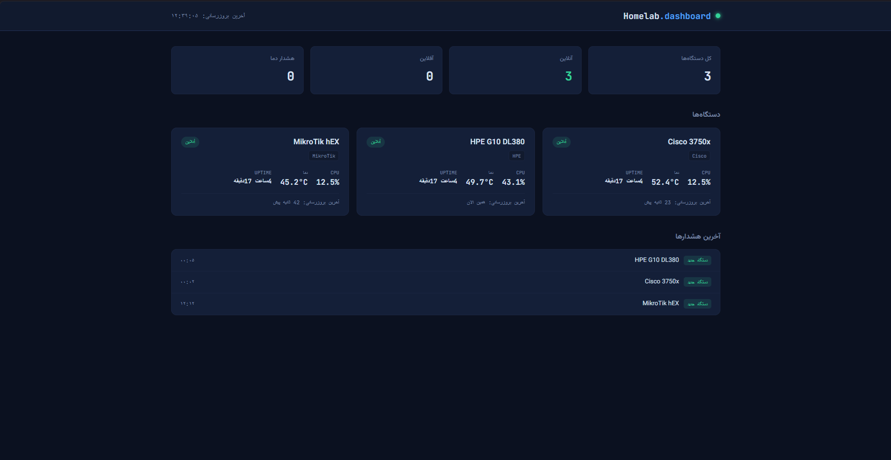

**English | [فارسی](./Translation/README-fa.md)**

# Homelab Monitoring Dashboard 🖥️📡

This is a simple monitoring dashboard I put together for my homelab. It runs on **shared PHP hosting** — so no VPS, no root access, and no extra infrastructure headaches. The idea was to keep everything lightweight, but still useful enough to track **MikroTik**, **Cisco**, and **HPE** devices from one place.

I built it for my own setup first, and then cleaned it up enough to be usable as a real project. The agents collect the data inside the homelab and push it to the server, so the dashboard can stay on cheap shared hosting and still show live status, history, and alerts.

---

## What it includes

* Live status cards for each device
* CPU, temperature, and traffic history charts
* Alert log for offline / online / over-temperature events
* Per-device temperature warning thresholds
* Push-based design that works behind NAT
* Separate Python agents for:

  * **MikroTik** via the RouterOS API
  * **Cisco** via SNMP
  * **HPE** via the Redfish API (iLO)
* HTTP Basic Auth protection for the dashboard
* Dark terminal-style UI with Vazirmatn and JetBrains Mono

## Preview



## How it works

Shared hosting cannot reach devices inside a private network, so the whole thing is set up as a **push-based** flow:

```text
[MikroTik]  ─┐
[Cisco]      ├─→  Python agents running on an always-on device in the homelab
[HPE/iLO]   ─┘
                     │
                     │  periodic POST requests (every 1–5 minutes via Task Scheduler)
                     ▼
            backend/ingest.php  (shared hosting, PHP + SQLite)
                     │
                     ▼
            backend/api_*.php  ←── frontend/ (web dashboard)
```

## Project structure

```text
homelab-dashboard/
├── backend/              # PHP APIs + SQLite database
│   ├── config.example.php
│   ├── db_init.php
│   ├── ingest.php        # receives data from agents
│   ├── api_devices.php   # current device status
│   ├── api_history.php   # history data for charts
│   └── api_alerts.php    # alert log
├── agent/                # Python collection scripts
│   ├── common.py
│   ├── mikrotik_agent.py + config.example.json
│   ├── cisco_agent.py    + cisco_config.example.json
│   ├── hpe_agent.py      + hpe_config.example.json
│   ├── requirements.txt
│   └── agent-README-en.md
├── frontend/             # web dashboard
│   ├── index.html
│   ├── style.css
│   ├── script.js
│   ├── config.js
│   └── .htaccess.example
├── screenshots/
│   └── dashboard.png
├── frontend_auth_helper/ # temporary helper tools for setting up password protection
├── Translation/
│   ├── agent-README-fa.md
│   └── README-fa.md
└── .gitignore
```

## Deployment

### Requirements

* Shared hosting with PHP 7.4+ and SQLite support (`pdo_sqlite`)
* An always-on device in your homelab to run the agents
* Python 3.9+ on that device

### 1. Backend

1. Upload the `backend/` folder to your host, for example `public_html/dashboard/backend`
2. Copy `config.example.php` to `config.php` and set a long random API key
3. Open `db_init.php` once in your browser to create the database, then remove or rename it
4. Send a test request to `ingest.php` with curl, Postman, or PowerShell

### 2. Agents

The setup for MikroTik, Cisco, and HPE is documented in [`agent/README.md`](./agent/README.md).

That guide covers the usual stuff:

* installing Python
* filling in the config files
* enabling RouterOS API / SNMP / Redfish on the device itself
* scheduling the scripts with Windows Task Scheduler

### 3. Frontend

1. Upload the `frontend/` folder next to `backend/`
2. If your folder layout is different, update `frontend/config.js`
3. Open the dashboard in your browser

### Optional: password-protect the dashboard

1. Temporarily upload `frontend_auth_helper/generate_hash.php` **outside** of `frontend/`
2. Use it to generate a password hash
3. Upload `frontend_auth_helper/show_path.php` inside `frontend/` to get the absolute path on the server
4. Copy `frontend/.htaccess.example` to `.htaccess` and set the correct `AuthUserFile`
5. Create a `.htpasswd` file in `frontend/` and paste the generated hash into it
6. Remove the helper files when you are done

## Testing `ingest.php`

Before connecting a real agent, you can test the backend manually.

**PowerShell:**

```powershell
$body = @{
    api_key = "your-api-key"
    device_key = "mikrotik-main"
    display_name = "MikroTik hEX"
    device_type = "mikrotik"
    cpu_percent = 12.5
    temperature_c = 45.2
    uptime_seconds = 123456
} | ConvertTo-Json

Invoke-RestMethod -Uri "https://yourdomain.com/dashboard/backend/ingest.php" -Method Post -Body $body -ContentType "application/json"
```

Expected response:

```json
{"success": true, "device_id": 1}
```

## Security notes

This repo’s `.gitignore` is set up so real secrets stay out of git. Only the `*.example.*` files are tracked.

Before pushing anything, run:

```bash
git status
```

and make sure these files are not staged:

* `backend/config.php`
* `agent/config.json`
* `agent/cisco_config.json`
* `agent/hpe_config.json`
* `frontend/.htaccess`
* `frontend/.htpasswd`
* `backend/database.sqlite`

## Built with

PHP · SQLite · Python (`routeros_api`, `pysnmp`, `requests`) · Chart.js · Vazirmatn · JetBrains Mono

## License

MIT — use it however you want in your own projects, with attribution.
